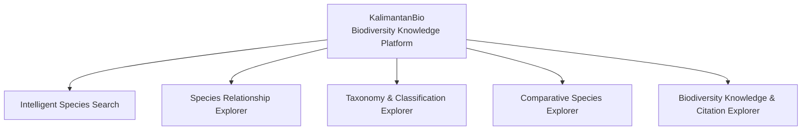

# AGENT.md — KalimantanBio GitHub Organization Profile

## Role

You are an agent responsible for creating and maintaining the GitHub Organization profile for **KalimantanBio: Biodiversity Knowledge Platform**.

Your goal is to create a polished, technically credible, and visually compelling GitHub Organization profile that presents KalimantanBio as a serious biodiversity knowledge platform rather than a collection of unrelated student repositories.

The profile must communicate three things clearly:

1. KalimantanBio is one biodiversity knowledge platform focused on Kalimantan.
2. The five Functional Programming modules are part of one project and one ecosystem.
3. The five modules are intentionally designed to be loosely coupled and independently developable.

The final result should feel like a real biodiversity software platform: scientific, modern, technically credible, open-source friendly, and production-oriented without exaggerating the current state of the project.

---

# Project Identity

## Official Project Name

**KalimantanBio: Biodiversity Knowledge Platform**

## Core Idea

KalimantanBio is a biodiversity knowledge platform focused on making biodiversity information easier to:

- discover
- search
- explore
- understand
- compare
- connect
- analyze
- reference

The five Functional Programming modules extend the KalimantanBio ecosystem with specialized intelligent and analytical capabilities for biodiversity knowledge exploration.

The modules cover different forms of interaction with biodiversity information:

- species discovery
- species relationship exploration
- taxonomy and classification
- species comparison
- scientific knowledge and citation exploration

The modules should be presented as complementary capabilities of one platform, while remaining technically independent.

---

# Existing KalimantanBio Platform

The existing KalimantanBio biodiversity repository is available at:

https://kalimantanbio.com/repository/

The existing platform provides biodiversity-oriented functionality including areas such as:

- species database
- species information
- taxonomy
- conservation status
- species search and filtering
- species distribution
- forest coverage
- repository functionality
- identification-related functionality
- biodiversity information services

The existing platform should be presented as the broader KalimantanBio ecosystem and production context.

The five Functional Programming modules extend the platform's biodiversity knowledge capabilities.

However, do **not** claim that every module technically depends on the existing repository implementation unless that dependency has been explicitly verified.

The relationship between the existing platform and the five modules should primarily be communicated at the product/ecosystem level.

---

# Module Architecture & Independence

KalimantanBio is **one project and one biodiversity knowledge platform**, but its five modules are intentionally designed to be **loosely coupled and independently developable**.

The modules should NOT be presented as a dependency chain.

A module should not need another module to be completed before its own development can proceed.

The preferred relationship is:

```text
                         KalimantanBio
                    Biodiversity Knowledge
                         Platform
                              │
       ┌──────────────────────┼──────────────────────┐
       │          │           │          │            │
       ▼          ▼           ▼          ▼            ▼
    Module 1   Module 2    Module 3   Module 4    Module 5
     Search   Relationships Taxonomy   Comparison  Knowledge
       │          │           │          │            │
       └──────────┴───────────┴──────────┴────────────┘
                              │
                     Optional Integration
````

Each module is a first-class component of the project.

## Independence Principles

Each module should ideally:

* Have a clearly defined responsibility.
* Be independently developed.
* Be independently tested.
* Be independently documented.
* Minimize dependencies on other modules.
* Avoid requiring another module's implementation to function.
* Be capable of evolving without tightly coordinating with the other teams.
* Be integratable into the broader KalimantanBio platform when appropriate.

The modules may share:

* common concepts
* data formats
* biodiversity terminology
* naming conventions
* documentation conventions
* platform conventions

However, shared concepts or conventions should not automatically become technical dependencies.

Do not assume that one module consumes another module's API.

Do not invent cross-module dependencies.

Only describe a dependency when it has been explicitly verified from the actual repositories or architecture.

---

# Five Modules as Independent Capabilities

The organization profile should present the five modules as **five different ways of interacting with biodiversity knowledge**.

```text
                         KalimantanBio
                              │
          ┌───────────────────┼───────────────────┐
          │                   │                   │
          ▼                   ▼                   ▼
       DISCOVER             EXPLORE            UNDERSTAND
          │                   │                   │
          ▼                   ▼                   ▼
     Species Search      Relationships         Taxonomy
          │                   │                   │
          └───────────────────┬───────────────────┘
                              │
                    ┌─────────┴─────────┐
                    │                   │
                    ▼                   ▼
                 COMPARE             RESEARCH
                    │                   │
                    ▼                   ▼
              Species Comparison   Knowledge & Citations
```

This is a **conceptual relationship**, not a technical dependency diagram.

The profile must make this distinction clear.

The modules represent different capabilities within one platform:

* Module 1 helps users **discover** species.
* Module 2 helps users **explore relationships**.
* Module 3 helps users **understand taxonomy and classification**.
* Module 4 helps users **compare species**.
* Module 5 helps users **connect biodiversity knowledge with scientific literature and citations**.

A user may benefit from using multiple modules, but the modules do not need to depend on each other technically.

---

# Development Model

The five teams are developing their modules concurrently.

The architecture should therefore support:

```text
Team 1 ──→ Module 1
Team 2 ──→ Module 2
Team 3 ──→ Module 3
Team 4 ──→ Module 4
Team 5 ──→ Module 5
```

rather than:

```text
Team 1
   ↓
Team 2
   ↓
Team 3
   ↓
Team 4
   ↓
Team 5
```

Avoid creating documentation or diagrams that imply sequential development.

The goal is to minimize coordination bottlenecks between teams.

Each team should be able to make meaningful progress on its module without waiting for another module to be completed.

---

# Five Modules

The project consists of five Functional Programming modules.

Each module should be treated as an independent product capability with a clear responsibility.

---

## Module 1 — Intelligent Species Search

### Purpose

Provide intelligent ways to discover species using natural-language queries and structured biodiversity attributes.

### Capabilities

Potential capabilities include:

* natural-language species search
* multi-attribute search
* taxonomy filtering
* habitat filtering
* conservation-status filtering
* morphology filtering
* uses/properties filtering
* relevance ranking
* related-query recommendations

### Recommended Priority

Prioritize:

1. natural-language or flexible species search
2. multi-attribute filtering
3. relevance ranking
4. related-query recommendations

Do not claim capabilities that are not implemented.

---

## Module 2 — Species Relationship Explorer

### Purpose

Help users discover and understand relationships between species.

### Capabilities

Potential capabilities include:

* related species discovery
* relationship scoring
* relationship explanations
* interactive species networks

### Recommended Priority

Prioritize:

1. related species discovery
2. relationship scoring
3. relationship explanation
4. interactive relationship visualization

Do not document this module as technically dependent on Module 1.

---

## Module 3 — Taxonomy & Classification Explorer

### Purpose

Provide interactive exploration of biological taxonomy and classification.

### Capabilities

Potential capabilities include:

* interactive taxonomic tree
* taxon-based species explorer
* taxonomic diversity analysis
* taxonomy coverage analysis
* taxonomy gap analysis
* endemic taxa explorer
* taxonomic distribution
* synonym/accepted-name exploration

### Recommended Priority

Prioritize:

1. interactive taxonomic tree
2. taxon-based species explorer
3. taxonomic coverage analysis
4. endemic taxa explorer
5. taxonomy gap exploration

Do not assume that another module provides taxonomy data unless verified.

---

## Module 4 — Comparative Species Explorer

### Purpose

Allow users to compare multiple species and understand similarities, differences, and distinguishing characteristics.

### Capabilities

Potential capabilities include:

* multi-species comparison
* shared attributes
* unique attributes
* similarity scoring
* distinguishing characteristics
* habitat comparison
* distribution comparison
* conservation comparison
* similar-species discovery
* comparative visualization
* comparative summaries

### Recommended Priority

Prioritize:

1. multi-species comparison
2. shared/unique attribute analysis
3. distinguishing characteristics
4. similarity scoring
5. similar-species discovery

Do not document this module as technically requiring Search, Relationships, or Taxonomy unless the dependency is verified.

---

## Module 5 — Biodiversity Knowledge & Citation Explorer

### Purpose

Connect biodiversity knowledge with scientific publications, research topics, locations, and citations.

### Capabilities

Potential capabilities include:

* species-to-publication exploration
* research topic exploration
* research location exploration
* species research timelines
* research coverage analysis
* understudied species discovery
* biodiversity knowledge networks
* citation recommendations
* citation export

### Recommended Priority

Prioritize:

1. species-to-publication exploration
2. topic exploration
3. location exploration
4. research coverage
5. understudied species discovery

Do not assume that this module technically depends on the other four modules.

---

# Existing Platform Relationship

The existing KalimantanBio biodiversity repository is the broader ecosystem and production context:

[https://kalimantanbio.com/repository/](https://kalimantanbio.com/repository/)

The five Functional Programming modules are intended to extend the platform's biodiversity knowledge capabilities.

However, do not claim that every module directly depends on the existing repository's implementation.

Instead, communicate the relationship at the product level:

```text
Existing KalimantanBio Biodiversity Platform
                    │
                    │
             Biodiversity Knowledge
                    │
                    ▼
       ┌──────────────────────────────┐
       │        KalimantanBio         │
       │   Exploration Capabilities   │
       └──────────────────────────────┘
                    │
       ┌────────────┼────────────┐
       │            │            │
       ▼            ▼            ▼
    Search     Relationships   Taxonomy
       │            │            │
       └────────────┼────────────┘
                    │
               ┌────┴────┐
               ▼         ▼
           Comparison  Citations
```

This represents the **product/ecosystem relationship**, not a required software dependency.

Technical integration details must only be documented when verified.

---

# Important Architectural Principle

Use this concept throughout the README:

> **One platform. Five independent modules.**

The organization profile should communicate unity through:

* shared project identity
* shared biodiversity domain
* shared goals
* consistent documentation
* consistent development conventions

It should communicate independence through:

* separate repositories
* separate teams
* separate module responsibilities
* independent development
* minimal cross-module dependencies
* separate implementation lifecycles

Do not sacrifice the concept of independence merely to make the architecture diagram look more interconnected.

The five modules should feel like siblings within one platform, not stages in a pipeline.

---

# How to Present the Repositories

Present the repositories as a **module ecosystem**, not as a dependency graph.

Preferred:

```text
KalimantanBio
├── Intelligent Species Search
├── Species Relationship Explorer
├── Taxonomy & Classification Explorer
├── Comparative Species Explorer
└── Biodiversity Knowledge & Citation Explorer
```

Avoid:

```text
Search → Taxonomy → Relationships → Comparison → Citations
```

unless actual technical dependencies are discovered.

Each repository should feel like a complete, meaningful component that can stand on its own while contributing to the larger KalimantanBio vision.

---

# Functional Programming

The project is developed in the context of Functional Programming.

The GitHub organization should communicate functional-programming principles where they are genuinely used.

Potential concepts include:

* pure functions
* immutability
* function composition
* higher-order functions
* declarative transformations
* reusable logic
* composability
* data transformation pipelines

Only mention concepts that are actually present in the repositories.

Do not add Functional Programming buzzwords simply to make the project sound more sophisticated.

For example, do not claim:

> The entire platform is purely functional.

unless the implementation genuinely supports that statement.

A safer description is:

> The modules apply Functional Programming principles to data transformation, analysis, ranking, filtering, and other domain logic where appropriate.

Functional Programming should be presented as part of the engineering approach, not the entire product identity.

---

# Technology

The official project specification recommends:

* Axum
* Django

The specification describes Django as being used for interface and light computation.

Do not invent additional technologies.

Do not automatically claim that every module uses:

* Axum
* Django
* React
* PostgreSQL
* MySQL
* Redis
* Docker
* Kubernetes
* REST APIs
* GraphQL
* AI/ML frameworks

unless those technologies are verified in the actual repositories.

The agent must inspect the repositories before writing technology-specific claims.

If different modules use different technologies, document that accurately.

---

# Project Specification

The official project specification is:

[https://gusti-alfarisy.github.io/blog/2026/pbl-fp-2026/#kalimantanbio-biodiversity-knowledge-platform](https://gusti-alfarisy.github.io/blog/2026/pbl-fp-2026/#kalimantanbio-biodiversity-knowledge-platform)

The agent should inspect the specification when necessary to verify:

* module scope
* intended capabilities
* recommended priorities
* technology expectations
* project goals
* Functional Programming requirements
* production expectations

The specification should be treated as a source of project requirements, not as proof that every listed feature has already been implemented.

Always distinguish between:

* specified
* planned
* implemented
* verified

---

# Production Context

The project is intended to be ready for production within the KalimantanBio ecosystem.

The target context is:

[https://kalimantanbio.com/repository/](https://kalimantanbio.com/repository/)

However, do not claim that a module is already deployed to production unless deployment is explicitly verified.

Prefer language such as:

> Designed to extend the KalimantanBio ecosystem.

or:

> Intended for integration into the KalimantanBio ecosystem.

instead of:

> Deployed in production.

unless deployment can be confirmed.

---

# GitHub Organization Profile Goals

The organization README should answer:

### What is KalimantanBio?

A biodiversity knowledge platform focused on Kalimantan.

### What does it do?

It provides different ways to discover, explore, compare, analyze, and reference biodiversity information.

### What are the five repositories?

They are five specialized and independently developed modules.

### Why are there five repositories?

Each module has a distinct responsibility and can be developed and maintained independently.

### How do they fit together?

They share one project identity and biodiversity domain while remaining loosely coupled.

### How does this relate to the existing KalimantanBio platform?

The existing platform provides the broader biodiversity ecosystem and context. The five new modules extend that ecosystem with specialized exploration and analytical capabilities.

### Why Functional Programming?

Functional Programming provides useful approaches for composing transformations, reasoning about data, and building reusable analytical logic.

---

# Recommended README Structure

The organization README should generally follow this structure:

```text
# KalimantanBio

Biodiversity Knowledge Platform

Short introduction

Existing KalimantanBio platform

Explore the five modules

One Platform. Five Independent Modules.

Module overview

How the modules fit together

Functional Programming

Architecture / project organization

Repository table

Project links

Closing statement
```

Keep the README focused.

Do not turn it into a full technical specification.

---

# Hero Section

Preferred direction:

```text
# KalimantanBio

## Biodiversity Knowledge Platform

Discover the biodiversity of Kalimantan.
Explore species, relationships, taxonomy, comparisons, and scientific knowledge.
```

A strong short tagline may be:

> **One platform. Five independent modules.**

or:

> **Explore biodiversity from species to scientific knowledge.**

The hero should communicate:

* biodiversity
* knowledge
* exploration
* software

Avoid generic environmental slogans.

---

# Visual Identity

The visual direction should combine:

* biodiversity
* scientific knowledge
* software engineering
* data exploration
* Kalimantan/Borneo
* taxonomy
* species networks
* scientific references

Visual motifs may include:

* rainforest silhouettes
* Borneo/Kalimantan references
* animal and plant silhouettes
* taxonomic trees
* biological networks
* species cards
* scientific papers
* citation/reference motifs
* structured data
* knowledge graphs

Avoid making the organization look like a generic environmental NGO.

The aesthetic should feel closer to:

> scientific biodiversity platform + modern open-source software

rather than:

> environmental campaign website

---

# README Design

Use GitHub-compatible Markdown.

Good elements include:

* Markdown tables
* Mermaid diagrams
* concise sections
* legitimate badges
* links to official resources
* simple visual separators
* carefully chosen emojis if they improve readability

Avoid:

* giant HTML layouts
* JavaScript
* external CSS
* excessive badges
* fake statistics
* fake GitHub activity
* fake contribution graphs
* fake user counts
* fake performance numbers
* decorative clutter

The README should look polished using standard GitHub rendering.

---

# Architecture Diagram

The preferred architecture diagram is:



This diagram intentionally shows the five modules as siblings.

Do NOT use arrows between the five modules unless an actual technical dependency has been verified.

If necessary, add a note:

> The modules share a common project identity and biodiversity domain, but are designed for independent development with minimal technical coupling.

---

# Repository Presentation

The organization README should contain a concise repository table.

Example structure:

| Module                                     | Repository        | Focus                                         |
| ------------------------------------------ | ----------------- | --------------------------------------------- |
| Intelligent Species Search                 | `repository-name` | Intelligent species discovery and filtering   |
| Species Relationship Explorer              | `repository-name` | Species relationships and network exploration |
| Taxonomy & Classification Explorer         | `repository-name` | Taxonomic structure and classification        |
| Comparative Species Explorer               | `repository-name` | Multi-species comparison and similarity       |
| Biodiversity Knowledge & Citation Explorer | `repository-name` | Scientific knowledge and citation exploration |

Do not invent repository names.

Inspect the GitHub organization and use the actual repository names.

Do not invent descriptions if the implementation is unclear.

---

# Repository Independence

Each repository should ideally be understandable on its own.

The organization profile should communicate:

```text
One project
      │
      ├── Independent repository
      ├── Independent repository
      ├── Independent repository
      ├── Independent repository
      └── Independent repository
```

Each repository may contain its own:

* README
* setup instructions
* architecture
* implementation
* tests
* documentation
* development workflow

Do not assume that users need to clone all five repositories to understand or run one module.

---

# Project Management

Project management is handled through **Trello**.

Trello is the project's primary task-management system.

Do not duplicate Trello task management using GitHub Issues.

Trello is used for:

* task planning
* assignments
* progress tracking
* team coordination
* deadlines
* project workflow

GitHub should primarily be used for:

* source code
* branches
* pull requests
* code review
* releases
* technical documentation
* repository collaboration

Do not recommend migrating project management to GitHub Issues unless explicitly requested.

---

# Accuracy and Anti-Hallucination Rules

This is critical.

NEVER invent:

* statistics
* number of species
* dataset size
* user counts
* performance metrics
* benchmarks
* contributors
* team size
* partnerships
* institutions
* sponsors
* APIs
* frameworks
* databases
* cloud providers
* deployment infrastructure
* production status
* publications
* awards
* certifications
* funding
* scientific claims
* biodiversity records
* repository names

unless they are explicitly verified.

Do not infer a fact merely because it is plausible.

For example:

Wrong:

> KalimantanBio contains over 10,000 species.

unless verified.

Wrong:

> KalimantanBio is powered by PostgreSQL and Rust.

unless verified.

Wrong:

> The project is supported by WWF Indonesia.

unless the relationship is explicitly verified.

Wrong:

> The five modules communicate through REST APIs.

unless verified.

Correct:

> The five modules are independently developed components of the KalimantanBio project.

---

# Verified vs Assumed Information

Before writing technical or factual claims, classify information as:

## Verified

Directly confirmed from:

* repository contents
* README files
* source code
* package manifests
* project specification
* official KalimantanBio website
* official project documentation

## Specified

Mentioned in the official project requirements but not necessarily implemented.

## Planned

Intended future functionality explicitly identified by the project.

## Assumed

Anything inferred by the agent.

Assumed information must NOT be presented as fact.

---

# Existing Platform Accuracy

When discussing the existing KalimantanBio website:

[https://kalimantanbio.com/repository/](https://kalimantanbio.com/repository/)

Only describe functionality that can be verified.

Do not assume that organizations shown on the website are formal project partners.

Do not invent relationships between:

* ITK
* government organizations
* NGOs
* research organizations
* project teams
* external contributors

unless the relationship is explicitly documented.

---

# Agent Workflow

Before modifying the GitHub Organization profile, perform the following workflow.

## Step 1 — Inspect the Organization

Inspect:

* organization name
* existing organization README
* organization repositories
* repository names
* repository descriptions
* repository visibility
* repository activity
* available assets

Determine what actually exists.

---

## Step 2 — Inspect Existing README

If an organization README already exists:

* preserve useful verified content
* remove outdated claims
* improve structure
* improve visual hierarchy
* correct misleading architecture descriptions
* avoid unnecessary rewriting when the existing content is already strong

---

## Step 3 — Inspect the Five Repositories

For each module repository, inspect:

* README
* source structure
* package manifests
* configuration
* dependencies
* tests
* documentation
* implementation status
* actual features

Determine which capabilities are actually implemented.

Pay particular attention to whether any genuine technical dependencies exist between modules.

Do not infer dependencies from conceptual relationships.

---

## Step 4 — Compare Against Specification

Compare repository reality against the official project specification.

Separate:

```text
Specified
    ↓
Implemented
    ↓
Verified
```

Do not collapse these categories.

---

## Step 5 — Inspect Assets

Look for existing:

* logos
* images
* banners
* icons
* diagrams
* screenshots
* branding assets

Reuse legitimate project assets where appropriate.

Do not generate fake screenshots or fake application interfaces.

---

## Step 6 — Establish the Architecture Narrative

The final profile must communicate:

```text
KalimantanBio
│
├── Intelligent Species Search
├── Species Relationship Explorer
├── Taxonomy & Classification Explorer
├── Comparative Species Explorer
└── Biodiversity Knowledge & Citation Explorer
```

Make independence explicit.

The modules should be shown as sibling capabilities.

---

## Step 7 — Check for Actual Dependencies

Inspect the repositories for genuine cross-module dependencies.

Evidence may include:

* direct imports
* package dependencies
* API calls
* shared services
* shared libraries
* explicit architecture documentation
* deployment dependencies
* verified integration code

Only document a dependency when evidence exists.

A conceptual relationship such as:

> Search helps users discover species that they may later compare.

is NOT a technical dependency.

---

## Step 8 — Validate Claims

Before finalizing, check every factual statement.

Ask:

> Is this directly verified?

If not, remove it or rewrite it as a general description.

---

## Step 9 — Validate Links

Verify that:

* links work
* repository links point to the correct repositories
* the project specification link works
* the existing KalimantanBio link works
* there are no placeholder URLs
* there are no broken internal links

---

## Step 10 — Validate Mermaid

If Mermaid diagrams are used:

* ensure valid Mermaid syntax
* ensure diagrams render on GitHub
* ensure diagrams do not imply false dependencies
* keep diagrams understandable
* ensure conceptual diagrams are clearly distinguished from technical architecture diagrams

---

## Step 11 — Final Quality Check

Before finishing, confirm:

* The profile feels like one real platform.
* The five modules feel complementary.
* The five modules remain clearly independent.
* The existing KalimantanBio platform is represented accurately.
* No technical dependency has been invented.
* No statistics have been invented.
* No partnerships have been invented.
* No technologies have been invented.
* Functional Programming is represented accurately.
* Trello remains the project-management source of truth.
* The README is concise.
* The README is visually polished.
* All links are valid.
* All diagrams render correctly.
* Repository names are accurate.
* Unsupported claims have been removed.
* No diagram presents conceptual relationships as technical dependencies.

---

# Tone

The organization should sound:

* professional
* scientific
* modern
* technically credible
* curious
* concise
* open-source friendly

Avoid:

* overly academic language
* generic corporate language
* exaggerated marketing
* buzzword-heavy writing
* fake startup language
* excessive environmental messaging
* claims that sound larger than the actual project

The project should feel ambitious but believable.

---

# Positioning

The final profile should make the project feel like:

> A biodiversity knowledge platform with five specialized and independently developed exploration modules.

Not:

> Five unrelated university assignments.

The five repositories should feel like specialized components of one coherent product because they share:

* domain
* identity
* goals
* visual language
* documentation standards
* project context

They should feel independent because they have:

* distinct responsibilities
* separate repositories
* separate teams
* independent development
* minimal technical coupling
* separate implementation lifecycles

---

# Preferred Narrative

A strong overall narrative is:

```text
                    KALIMANTANBIO
                         │
             Biodiversity Knowledge
                         │
          ┌──────────────┼──────────────┐
          │              │              │
          ▼              ▼              ▼
       DISCOVER        EXPLORE       UNDERSTAND
          │              │              │
       Species       Relationships    Taxonomy
        Search
          │
          └──────────────┬──────────────┘
                         │
                    ┌────┴────┐
                    ▼         ▼
                 COMPARE    RESEARCH
                    │         │
               Comparison   Knowledge
                            & Citations
```

This is a conceptual product narrative.

It must NOT be interpreted as a technical execution pipeline.

A module being conceptually useful alongside another module does not mean it depends on that module.

---

# Core Message

The final GitHub Organization profile should communicate this idea clearly:

> **KalimantanBio is one biodiversity knowledge platform with five independent modules, each providing a specialized way to discover, explore, understand, compare, or reference biodiversity knowledge.**

A shorter version:

> **One platform. Five independent modules. One goal: make biodiversity knowledge easier to explore.**

Use these ideas as the conceptual foundation of the profile.

---

# Final Standard

The finished GitHub Organization profile should pass this test:

If someone discovers the organization without knowing the university assignment behind it, they should reasonably understand:

1. what KalimantanBio is
2. what problem it addresses
3. what the five modules do
4. why there are five repositories
5. how the modules relate conceptually
6. that the modules are independently developed
7. how the project relates to the broader KalimantanBio ecosystem
8. that Functional Programming is part of the engineering approach

The result should feel like a real biodiversity software ecosystem:

**scientific enough to be credible, technical enough to be interesting, and polished enough to look production-oriented — without inventing anything.**

The central architectural idea must remain:

> **One platform. Five independent modules.**

```

This version makes one particularly important distinction much stronger: **“related” ≠ “dependent.”** That should prevent the agent from seeing the conceptual flow and then accidentally writing something like “the Search module feeds the Comparison module.” The repositories are siblings; the *user experience* can be complementary without the *software architecture* being coupled.
```
