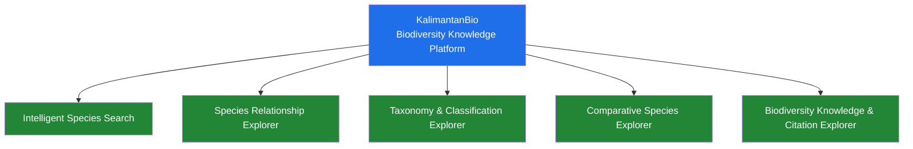
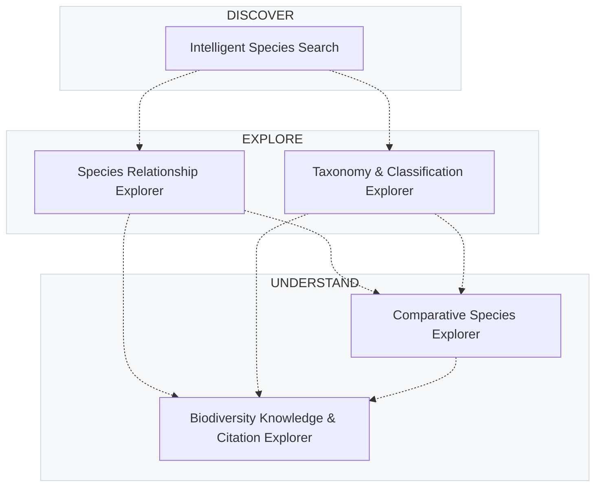

# KalimantanBio

## Biodiversity Knowledge Platform

Discover the biodiversity of Kalimantan.  
Explore species, relationships, taxonomy, comparisons, and scientific knowledge.

> **One platform. Five independent modules.**

---

## Existing KalimantanBio Platform

The broader KalimantanBio ecosystem and production context:

[https://kalimantanbio.com/repository/](https://kalimantanbio.com/repository/)

The existing platform provides a comprehensive biodiversity information system including:
- Species database with 100+ documented records
- Taxonomic classification and conservation status
- Spatial distribution mapping
- Forest coverage visualization
- Repository and dataset services
- Species identification tools
- Research permit management

The five Functional Programming modules extend this ecosystem with specialized intelligent and analytical capabilities for biodiversity knowledge exploration.

---

## Explore the Five Modules



The modules share a common project identity and biodiversity domain, but are designed for independent development with minimal technical coupling.

---

## One Platform. Five Independent Modules.

| Module | Focus | Capabilities |
|--------|-------|--------------|
| **Intelligent Species Search** | Species discovery | Natural-language queries, multi-attribute filtering, relevance ranking, related-query recommendations |
| **Species Relationship Explorer** | Relationship exploration | Related species discovery, relationship scoring, explanations, interactive networks |
| **Taxonomy & Classification Explorer** | Taxonomic understanding | Interactive taxonomic tree, taxon-based explorer, coverage analysis, endemic taxa, gap analysis |
| **Comparative Species Explorer** | Species comparison | Multi-species comparison, shared/unique attributes, similarity scoring, distinguishing characteristics |
| **Biodiversity Knowledge & Citation Explorer** | Scientific knowledge | Species-to-publication links, topic/location exploration, research coverage, understudied species, citation export |

Each module is a first-class component with:
- Clearly defined responsibility
- Independent development, testing, and documentation
- Separate repository and team
- Minimal cross-module dependencies
- Independent implementation lifecycle

---

## How the Modules Fit Together

### Conceptual Relationship (Not Technical Dependency)



> **Dashed lines indicate conceptual complementarity, not technical dependencies.**  
> A user may benefit from using multiple modules, but no module requires another to function.

### Development Model

```text
Team 1 ──→ Intelligent Species Search
Team 2 ──→ Species Relationship Explorer
Team 3 ──→ Taxonomy & Classification Explorer
Team 4 ──→ Comparative Species Explorer
Team 5 ──→ Biodiversity Knowledge & Citation Explorer
```

Concurrent development with minimal coordination bottlenecks.

---

## Functional Programming

The modules apply Functional Programming principles where appropriate:

- **Pure functions** for data transformation and analysis logic
- **Immutability** for predictable state management
- **Function composition** for building reusable analytical pipelines
- **Higher-order functions** for flexible filtering, ranking, and transformation
- **Declarative transformations** for biodiversity data processing

Functional Programming is part of the engineering approach, not the entire product identity.

---

## Technology

The project specification recommends:
- **Axum** — Rust web framework for performant APIs
- **Django** — Python framework for interfaces and light computation

Actual technology choices per module are determined by each team and documented in their respective repositories.

---

## Architecture Overview

```
KalimantanBio
├── Intelligent Species Search
├── Species Relationship Explorer
├── Taxonomy & Classification Explorer
├── Comparative Species Explorer
└── Biodiversity Knowledge & Citation Explorer
```

Each repository contains its own:
- README with setup and usage instructions
- Architecture and implementation documentation
- Tests and development workflow
- Independent release cycle

---

## Project Links

| Resource | Link |
|----------|------|
| **Project Specification** | <https://gusti-alfarisy.github.io/blog/2026/pbl-fp-2026/#kalimantanbio-biodiversity-knowledge-platform> |
| **Existing Platform** | <https://kalimantanbio.com/repository/> |
| **Organization** | <https://github.com/BorneoBiodiverse> |
| **Project Management** | Trello (primary task management) |

---

## Project Management

**Trello** is the primary task-management system for planning, assignments, progress tracking, and team coordination.

GitHub is used for:
- Source code and version control
- Branches, pull requests, and code review
- Releases and technical documentation
- Repository collaboration

---

## Contributing

Each module repository defines its own contribution guidelines. Please refer to the individual repository READMEs for setup, development workflow, and contribution processes.

---

## License

Individual modules may have their own licenses. Check each repository for details.

---

*KalimantanBio — Making biodiversity knowledge easier to discover, explore, understand, compare, and reference.*