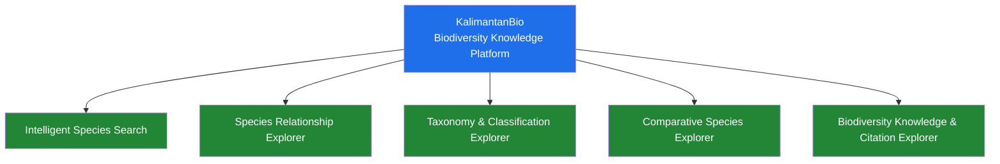
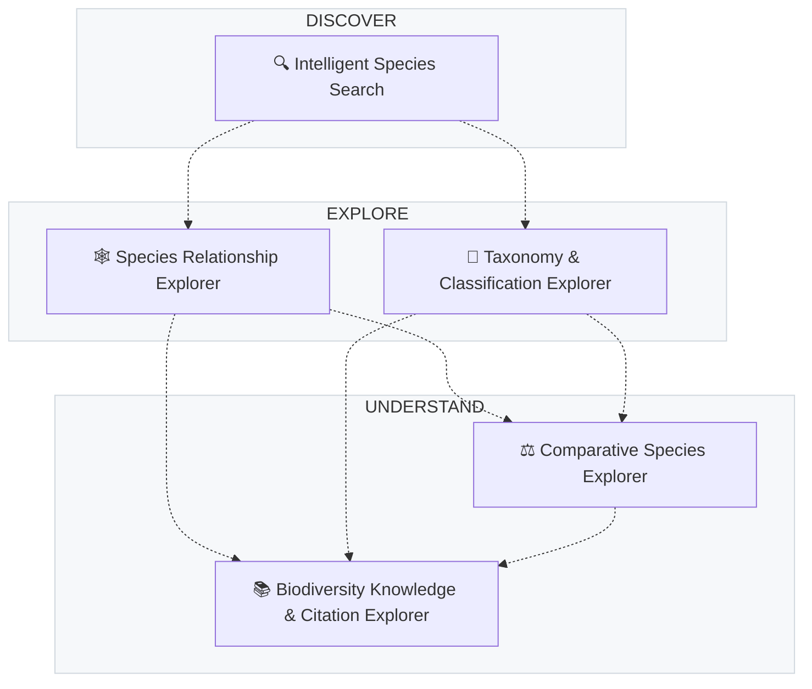

<p align="center">
  
</p>

<h1 align="center">KalimantanBio</h1>

<p align="center">
  <strong>Biodiversity Knowledge Platform</strong>
</p>

<p align="center">
  Discover the biodiversity of Kalimantan.<br />
  Explore species, relationships, taxonomy, comparisons, and scientific knowledge.
</p>

<p align="center">
  <strong>One platform. Five independent modules.</strong>
</p>

<p align="center">
  <a href="https://kalimantanbio.com/repository/">
    
  </a>
  <a href="https://gusti-alfarisy.github.io/blog/2026/pbl-fp-2026/#kalimantanbio-biodiversity-knowledge-platform">
    
  </a>
  <a href="https://github.com/BorneoBiodiverse">
    
  </a>
</p>

<p align="center">
  
  
  
  
  
</p>

---

## 🌴 Existing KalimantanBio Platform

The broader KalimantanBio ecosystem and production context:

[https://kalimantanbio.com/repository/](https://kalimantanbio.com/repository/)

<p align="center">
  
</p>

<p align="center">
  <em>Kauri Borneo (Agathis borneensis) — Endangered conifer endemic to Borneo</em>
</p>

The existing platform provides a comprehensive biodiversity information system including:

- **Species database** with 100+ documented records
- **Taxonomic classification** and conservation status (IUCN)
- **Spatial distribution mapping** across Kalimantan
- **Forest coverage visualization** via GIS
- **Repository and dataset services** for research
- **Species identification tools**
- **Research permit management** with institutional partners

The five Functional Programming modules extend this ecosystem with specialized intelligent and analytical capabilities for biodiversity knowledge exploration.

---

## 🌿 Explore the Five Modules



The modules share a common project identity and biodiversity domain, but are designed for independent development with minimal technical coupling.

---

## 📦 One Platform. Five Independent Modules.

| Module | Focus | Capabilities |
|--------|-------|--------------|
| **🔍 Intelligent Species Search** | Species discovery | Natural-language queries, multi-attribute filtering, relevance ranking, related-query recommendations |
| **🕸️ Species Relationship Explorer** | Relationship exploration | Related species discovery, relationship scoring, explanations, interactive networks |
| **🌳 Taxonomy & Classification Explorer** | Taxonomic understanding | Interactive taxonomic tree, taxon-based explorer, coverage analysis, endemic taxa, gap analysis |
| **⚖️ Comparative Species Explorer** | Species comparison | Multi-species comparison, shared/unique attributes, similarity scoring, distinguishing characteristics |
| **📚 Biodiversity Knowledge & Citation Explorer** | Scientific knowledge | Species-to-publication links, topic/location exploration, research coverage, understudied species, citation export |

Each module is a first-class component with:
- Clearly defined responsibility
- Independent development, testing, and documentation
- Separate repository and team
- Minimal cross-module dependencies
- Independent implementation lifecycle

---

## 🔗 How the Modules Fit Together

### Conceptual Relationship (Not Technical Dependency)



> **Dashed lines indicate conceptual complementarity, not technical dependencies.**  
> A user may benefit from using multiple modules, but no module requires another to function.

### Development Model

```text
Team 1 ──→ 🔍 Intelligent Species Search
Team 2 ──→ 🕸️ Species Relationship Explorer
Team 3 ──→ 🌳 Taxonomy & Classification Explorer
Team 4 ──→ ⚖️ Comparative Species Explorer
Team 5 ──→ 📚 Biodiversity Knowledge & Citation Explorer
```

Concurrent development with minimal coordination bottlenecks.

---

## ⚡ Functional Programming

The modules apply Functional Programming principles where appropriate:

| Principle | Application |
|-----------|-------------|
| **Pure functions** | Data transformation and analysis logic |
| **Immutability** | Predictable state management |
| **Function composition** | Reusable analytical pipelines |
| **Higher-order functions** | Flexible filtering, ranking, transformation |
| **Declarative transformations** | Biodiversity data processing |

Functional Programming is part of the engineering approach, not the entire product identity.

---

## 🛠️ Technology Stack

The project specification recommends:

| Technology | Role | Badge |
|------------|------|-------|
| **Axum** | Rust web framework for performant APIs |  |
| **Django** | Python framework for interfaces & light computation |  |

Actual technology choices per module are determined by each team and documented in their respective repositories.

---

## 🏗️ Architecture Overview

```
KalimantanBio
├── 🔍 Intelligent Species Search
├── 🕸️ Species Relationship Explorer
├── 🌳 Taxonomy & Classification Explorer
├── ⚖️ Comparative Species Explorer
└── 📚 Biodiversity Knowledge & Citation Explorer
```

Each repository contains its own:
- README with setup and usage instructions
- Architecture and implementation documentation
- Tests and development workflow
- Independent release cycle

---

## 🔗 Project Links

| Resource | Link |
|----------|------|
| **Project Specification** | <https://gusti-alfarisy.github.io/blog/2026/pbl-fp-2026/#kalimantanbio-biodiversity-knowledge-platform> |
| **Existing Platform** | <https://kalimantanbio.com/repository/> |
| **GitHub Organization** | <https://github.com/BorneoBiodiverse> |
| **Project Management** | Trello (primary task management) |

---

## 📋 Project Management

**Trello** is the primary task-management system for planning, assignments, progress tracking, and team coordination.

GitHub is used for:
- Source code and version control
- Branches, pull requests, and code review
- Releases and technical documentation
- Repository collaboration

---

## 👥 Team & Contributors

### Project Leader

| | |
|---|---|
| <a href="https://github.com/sleepymor"></a> | **[@sleepymor](https://github.com/sleepymor)** — Project Leader & Organization Owner |
| | KalimantanBio: Biodiversity Knowledge Platform |

### Organization Members

<!-- ORG_MEMBERS_START -->

<table><tbody><tr><td align="center" width="25%"><a href="https://github.com/Alizah14"><br /><sub><b>@Alizah14</b></sub></a></td><td align="center" width="25%"><a href="https://github.com/atechforce"><br /><sub><b>@atechforce</b></sub></a></td><td align="center" width="25%"><a href="https://github.com/Bieraaa"><br /><sub><b>@Bieraaa</b></sub></a></td><td align="center" width="25%"><a href="https://github.com/Jayennn"><br /><sub><b>@Jayennn</b></sub></a></td></tr><tr><td align="center" width="25%"><a href="https://github.com/Kiana0130"><br /><sub><b>@Kiana0130</b></sub></a></td><td align="center" width="25%"><a href="https://github.com/nirvanaguys"><br /><sub><b>@nirvanaguys</b></sub></a></td><td align="center" width="25%"><a href="https://github.com/NotHydra"><br /><sub><b>@NotHydra</b></sub></a></td><td align="center" width="25%"><a href="https://github.com/peroyoo"><br /><sub><b>@peroyoo</b></sub></a></td></tr><tr><td align="center" width="25%"><a href="https://github.com/sleepymor"><br /><sub><b>@sleepymor</b></sub></a></td><td align="center" width="25%"><a href="https://github.com/Thisyath"><br /><sub><b>@Thisyath</b></sub></a></td><td></td><td></td></tr></tbody></table>

*Last updated: 2026-09-05 12:37 UTC*
<!-- ORG_MEMBERS_END -->

*Last updated: $(date -u +"%Y-%m-%d %H:%M UTC")*

### Module Teams

Five teams developing concurrently across five independent modules:

| Team | Module | Focus |
|------|--------|-------|
| Team 1 | 🔍 Intelligent Species Search | Natural-language species discovery & filtering |
| Team 2 | 🕸️ Species Relationship Explorer | Species relationships & network exploration |
| Team 3 | 🌳 Taxonomy & Classification Explorer | Taxonomic structure & classification |
| Team 4 | ⚖️ Comparative Species Explorer | Multi-species comparison & similarity |
| Team 5 | 📚 Biodiversity Knowledge & Citation Explorer | Scientific literature & citation exploration |

> **Note:** Organization members are private. Team members contribute through their respective module repositories.

---

## 🤝 Contributing

Each module repository defines its own contribution guidelines. Please refer to the individual repository READMEs for setup, development workflow, and contribution processes.

---

## 📄 License

Individual modules may have their own licenses. Check each repository for details.

---

<p align="center">
  <em>KalimantanBio — Making biodiversity knowledge easier to discover, explore, understand, compare, and reference.</em>
</p>

<p align="center">
  
  <br />
  <em>Raja Udang Kalung-biru (Alcedo euryzona) — Critically Endangered</em>
</p>
